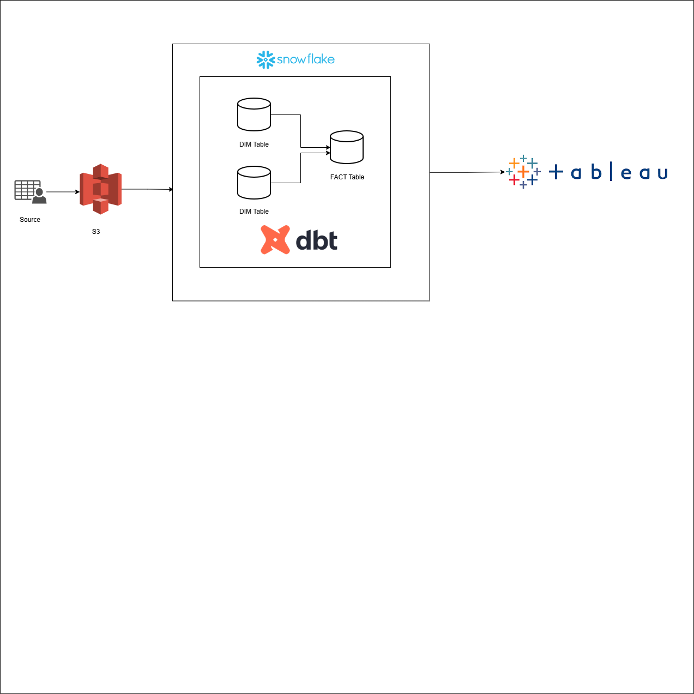

# BI-Walmart-Data-Analysis-Project

# Objective

Analyze Walmart’s sales performance.

# Abstract 
Build a scalable, clean, and automated data pipeline that ingests raw Walmart data, models it into dimensions/fact tables, and visualizes it in Tableau dashboards.

# Architecture

  

